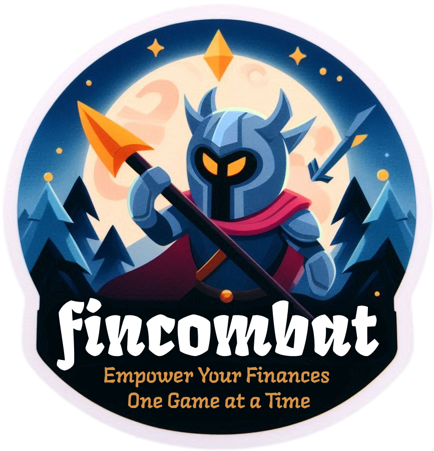

</img>

<!-- <h1 align="center">FinCombat</h1>

<b>Empower Your Finances, One Game at a Time</b>
 -->

FinCombat tackles financial illiteracy by making learning about money enjoyable and accessible through interactive gameplay. It offers diverse challenges like budgeting, saving, investing, debt management, and retirement planning. Users receive personalized feedback, ensuring they grasp financial concepts effectively. 

**How it helps:**
1. **Engaging Learning:** Users enjoy learning through game features like levels, quizzes, and interactive tutorials.
2. **Personalized Guidance:** FinCombat tailors feedback to each user, helping them understand their strengths and areas for improvement.
3. **Inclusivity:** It's designed for everyone, ensuring all users, regardless of age or ability, can benefit from financial education.

**Implementation:**
- Develop FinCombat as a web and mobile application.
- Utilize technologies like React.js (frontend), Node.js with Express.js (backend), MongoDB (database), and Firebase (real-time data sync).
- Offer gamified challenges covering key financial topics.
- Provide personalized feedback and recommendations to users based on their performance and progress.

**Proposed Tech Stack:**
- Web development technologies: HTML, CSS, JavaScript
- Frontend framework: React.js / React Native
- Backend development framework: Node.js with Express.js
- Database management system: MongoDB
- Real-time database: Firebase Realtime Database / Firestore
- File storage: Amazon S3
- Analytics & monitoring tools: Google Analytics, Mixpanel, New Relic
- Authentication & authorization: Firebase Authentication, External Providers
- External services integration: Algolia, Amazon SNS, sendwithus
